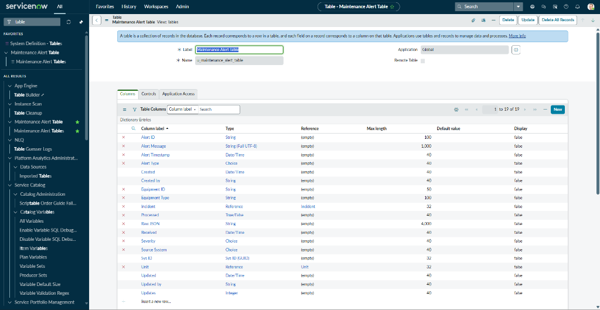
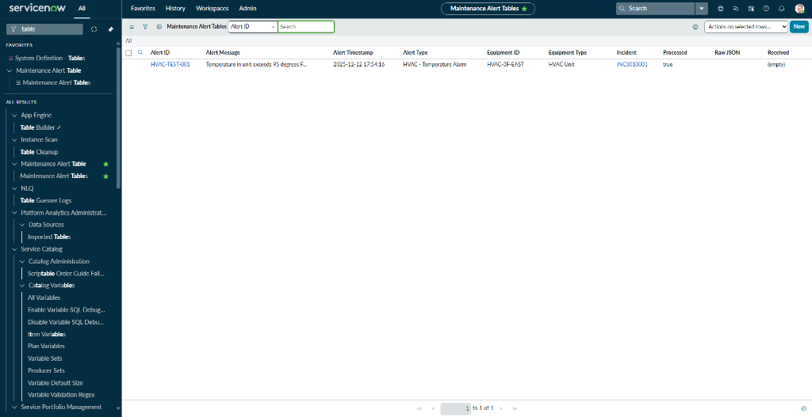
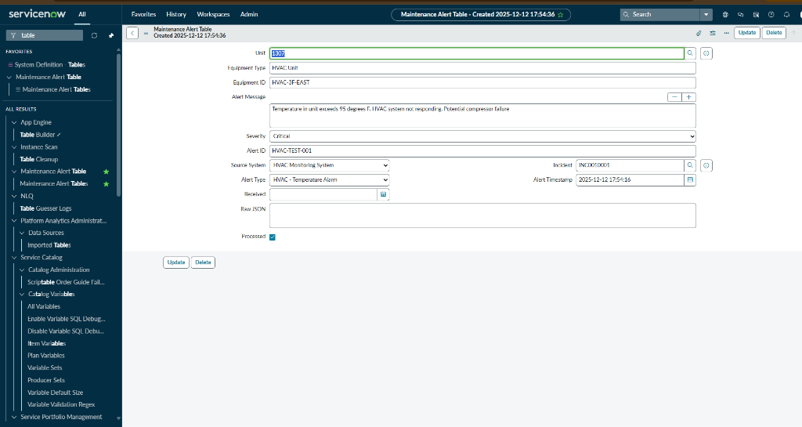
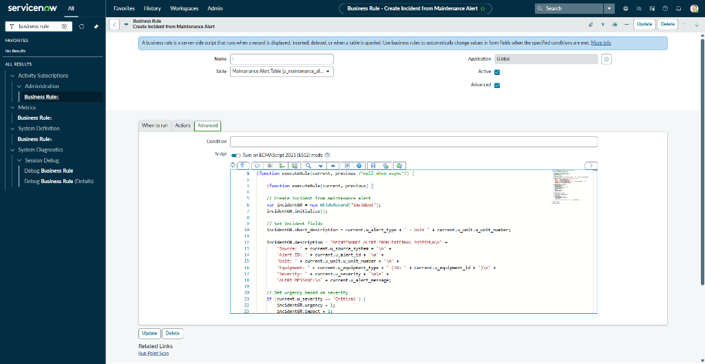
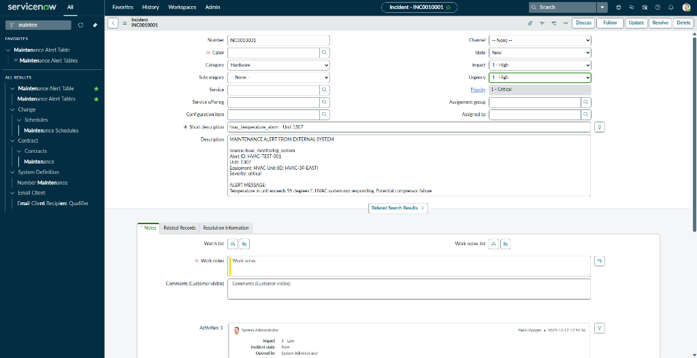

# Technical Brief: IoT Alert Processing System

## The Problem
Maintenance response times are the "silent killers" of industrial productivity. Previously, critical equipment alerts (HVAC failures, water leaks, fire alarms) were siloed in external email systems or SMS threads. It required 30+ minutes of manual intervention to translate an alert into a ServiceNow incident. In a 24/7 operation, this lag time often meant the difference between a minor repair and a catastrophic facility failure.

## The Solution
I built an **Automatic Alert System** on the **ServiceNow Zurich release** that connects equipment sensors directly to ServiceNow. By centralizing alert capture and automating incident routing, I eliminated manual data entry and ensured that specialists are dispatched within seconds of an equipment failure.

---

## Technical Architecture

### How Alerts Are Handled
I designed the system to use a **"Landing Zone"** (a temporary table) on a custom table rather than creating tickets directly.
*   **How it works:** Sending data into a temporary table (`u_maintenance_alert`) allows us to clean up duplicates and check the data *before* creating a ticket. This protects the system from sensors sending too many repetitive alerts and makes sure we only track real maintenance issues.
*   **Ready for more sensors:** The setup is ready to connect directly to external monitoring systems in the future.

### Server-Side Rules (Script Includes)
The system uses a simple rule that sends the work to the **AlertUtils** script.
*   **Why I did this:** I moved the ticket creation and routing rules into one organized script to make sure they are easy to test. This setup makes sure that every alert is handled the same way every time.
*   **Tracing the Alert:** Using the script, I made sure the alert and the ticket are permanently linked, so you can always see exactly what sensor message triggered the work.

### Data Connections
*   **Tracing the Work:** I established a permanent link between the Alert and the Incident. Someone reviewing the records can trace any work order back to the exact sensor message that triggered it.
*   **Connecting to Equipment:** The system connects the alerts to the `u_unit` table, ensuring that maintenance data is tied to the right equipment in our records.

---

## Key Features
*   **Zero-Touch Incident Creation:** High-severity alerts trigger incident records automatically without human oversight, enabling 24/7 response capabilities.
*   **Intelligent Assignment Engine:** Eliminates manual dispatching; the system knows exactly which trade specialist needs to handle which alert.
*   **Production-Ready Integration Pattern:** The architecture is designed to transition from manual entry to full IoT REST API integration with minimal code changes.

## How to Review
To evaluate the technical quality of this system, please review:
*   **Organized Alert Engine:** `scripts/AlertUtils.js` - See how I handled the data and groups in one organized script.
*   **Inbound Pattern:** `scripts/ScriptedREST_Pattern.js` - My plan for connecting more sensors in the future.

---

## Screenshots

### Alert Capture Table Schema
  
*Custom integration table with severity classification, alert type routing, and bidirectional incident linking*

### Real-Time Alert Feed
  
*Live event stream showing HVAC failures, water leaks, fire alarms, and equipment malfunctions*

### Alert Detail Record
  
*Complete event record showing unit location, severity, and auto-created incident reference*

### Automation Logic
  
*Server-side JavaScript showing conditional processing, GlideRecord operations, and assignment routing*

### Auto-Generated Incident
  
*Work order automatically created, populated, and assigned from maintenance alert*

---

- Custom Table Integration

---
**Developed by Laurenda Landry**  
*10 years experience in Industrial Operations & Compliance*
